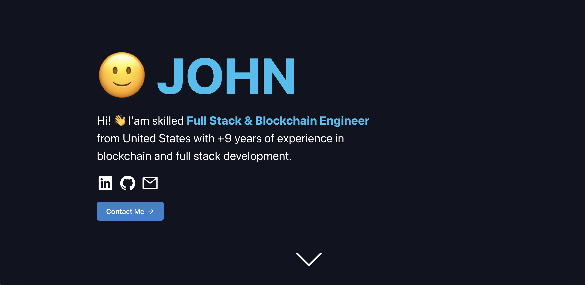

# Portfolio Website
My portfolio website show-casing my skillset, favourite projects and certificates from one of the biggest blockchain academies - Moralis Academy. 

Please leave a ⭐ if you like it.

## Try It Out
My portfolio website is live [here](https://crypto-smile.vercel.app/).

If you find any **errors** ⛔, please report them to [john.arnold.crypto@gmail.com](mailto:john.arnold.crypto@gmail.com) thanks 🙏.

## Technologies
For this project I used:
- [React](https://reactjs.org/)
- [TypeScript](https://www.typescriptlang.org/) and [CSS](https://developer.mozilla.org/en-US/docs/Web/CSS)

## About Me
Hi! 👋 I'm John, passionate **blockchain developer** from United States. Take a look at my [portfolio](https://crypto-smile.vercel.app/).

You can get in touch with me through my [website](https://crypto-smile.vercel.app/).

## License
[MIT](https://choosealicense.com/licenses/mit/)